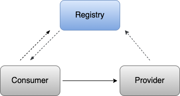

# simple-rpc

[](https://github.com/simplefanC/simple-rpc/blob/main/LICENSE)
[](https://openjdk.org) 
[](https://zookeeper.apache.org)
[](https://netty.io)
[](https://github.com/EsotericSoftware/kryo)

一款基于 Netty+Kryo+Zookeeper 实现的 RPC 框架。自定义starter完成与Spring的整合，简化了框架的使用。通过 SPI 机制提供了非常灵活的可扩展性。

## 架构



## 特性

- 注册中心：使用 Zookeeper 实现服务注册与发现
- 网络传输：使用 Netty 实现网络传输
- 序列化：支持 Kryo、Hessian、Protostuff 等
- 负载均衡：支持随机、轮询、加权轮询和一致性哈希等
- 配置灵活：序列化方式、注册中心的实现方式、负载均衡算法等均可在配置文件灵活配置
- 可拓展性：基于SPI 机制实现可插拔式拓展组件

## 项目结构

```
simple-rpc
├── framework -- 框架代码
├────── common -- 基础工具类
├────── core -- 框架核心代码
├── rpc-spring-boot-starter -- 自定义starter整合Spring
├── example -- 使用示例代码
├────── api -- 服务接口定义
├────── consumer -- 服务消费者
└────── provider -- 服务提供者
```

## 使用方法
1. 下载代码到本地
```bash
git clone https://github.com/simplefanC/simple-rpc.git
```
2. 打包到本地
```bash
mvn clean install -DskipTests=true
```
3. 添加Maven依赖到你的项目中
 ```xml
 <dependency>
   <groupId>com.simplefanc</groupId>
   <artifactId>rpc-spring-boot-starter</artifactId>
   <version>1.0-SNAPSHOT</version>
 </dependency>
 ```
 ### 客户端
使用`@RpcReference`注解注入服务。
 ```java
@RestController
@RequestMapping("/hello")
public class HelloController {

    @RpcReference(version = "version1", group = "test1")
    private HelloService helloService;

    @GetMapping("/test")
    public String test() {
        return this.helloService.hello(new Hello("111", "222"));
    }
}
 ```
配置项：
|    属性 |含义      |  可选项   |
| --- | --- | --- |
| rpc.registry-address | 注册中心地址     | localhost:2181（默认）             |
| rpc.registry-protocol | 注册中心地址协议 | zookeeper（默认），redis           |
| rpc.transporter | 网络传输方式 | netty（默认），socket |
| rpc.serialization     | 消息序列化协议   | kryo（默认），protostuff，hessian      |
| rpc.compress | 压缩方案 | gzip（默认） |
| rpc.loadbalance       | 负载均衡算法     | random<br>round<br>weightRound<br>hash |


 ### 服务端
使用`@RpcService`注解发布服务。
 ```java
@Slf4j
@RpcService(group = "test1", version = "version1")
public class HelloServiceImpl implements HelloService {
    @Override
    public String hello(Hello hello) {
        log.info("HelloServiceImpl收到: {}.", hello.getMessage());
        String result = "Hello description is " + hello.getDescription();
        log.info("HelloServiceImpl返回: {}.", result);
        return result;
    }
}
 ```
 配置项：
|    属性 |含义      |  可选项   |
| --- | --- | --- |
| rpc.server-port |服务暴露端口 | 9999（默认） |
| rpc.registry-address  | 注册中心地址     | localhost:2181（默认）                 |
| rpc.registry-protocol | 注册中心地址协议 | zookeeper（默认），redis               |
| rpc.transporter       | 网络传输方式     | netty（默认），socket                  |
| rpc.serialization     | 消息序列化协议   | kryo（默认），protostuff，hessian      |
| rpc.compress          | 压缩方案         | gzip（默认）                           |
| rpc.weight | 权重 | 1（默认） |

## TODO

- [ ] 服务监控中心
